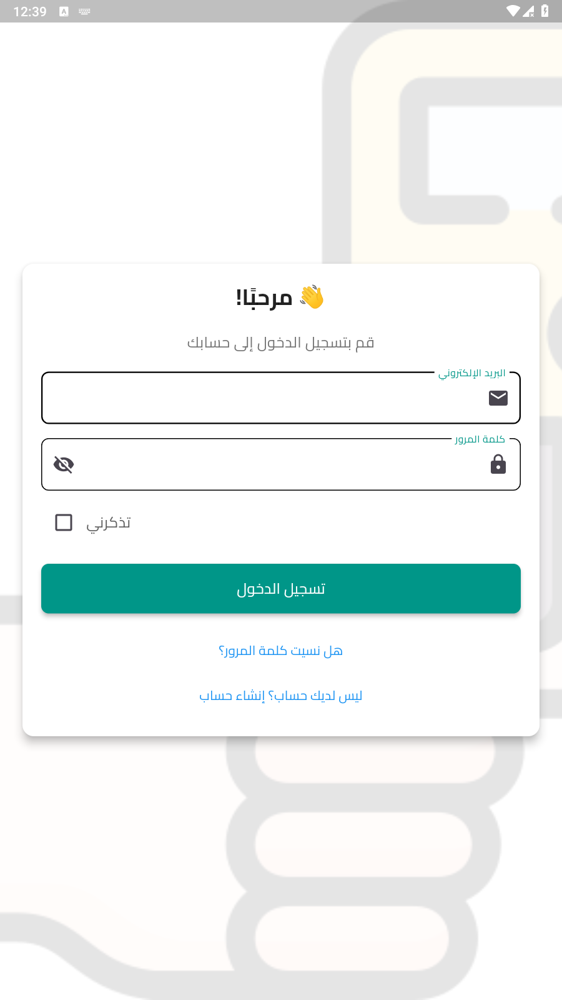
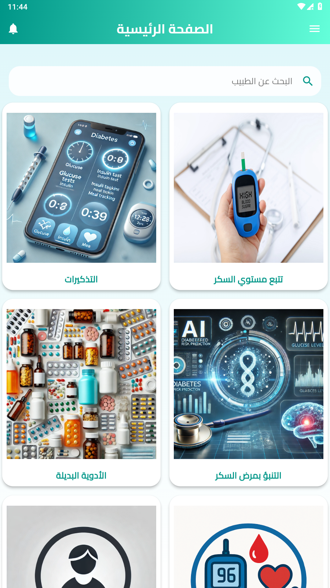
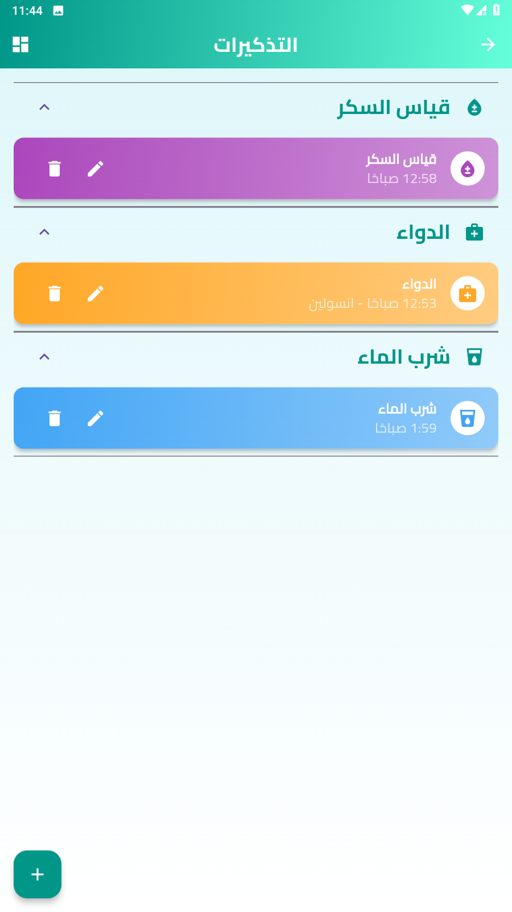
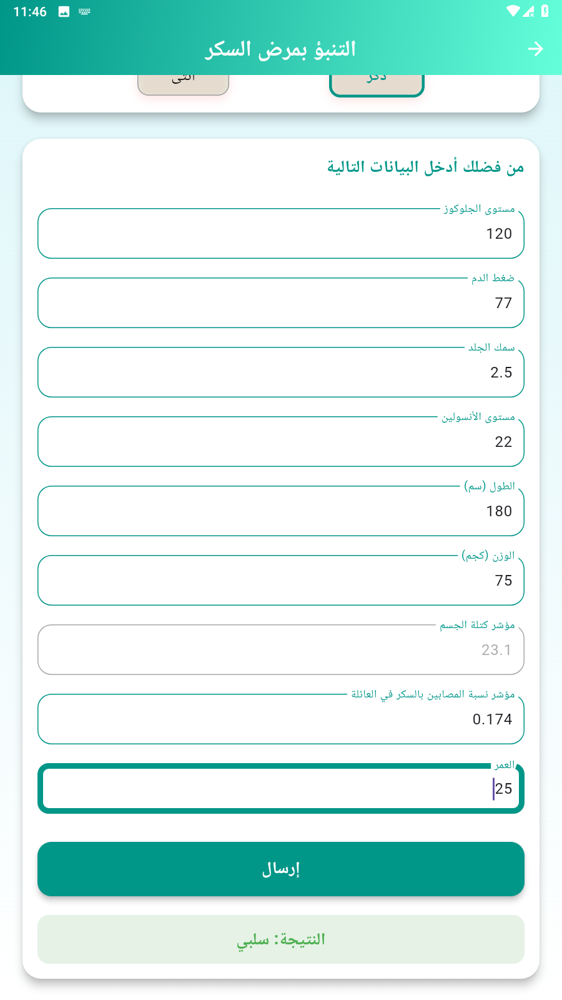
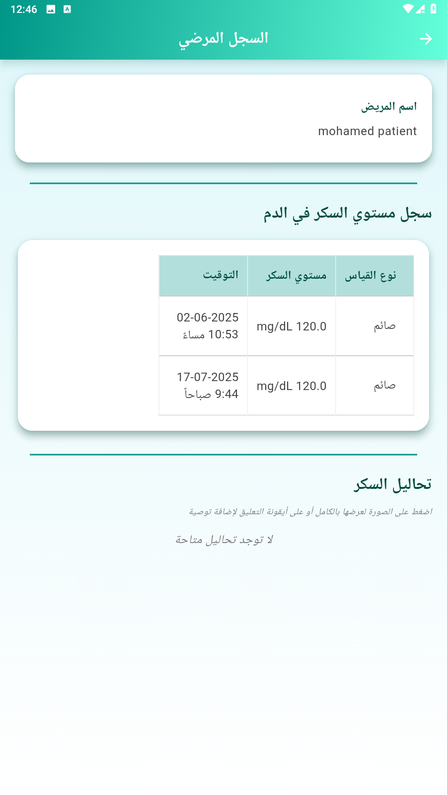
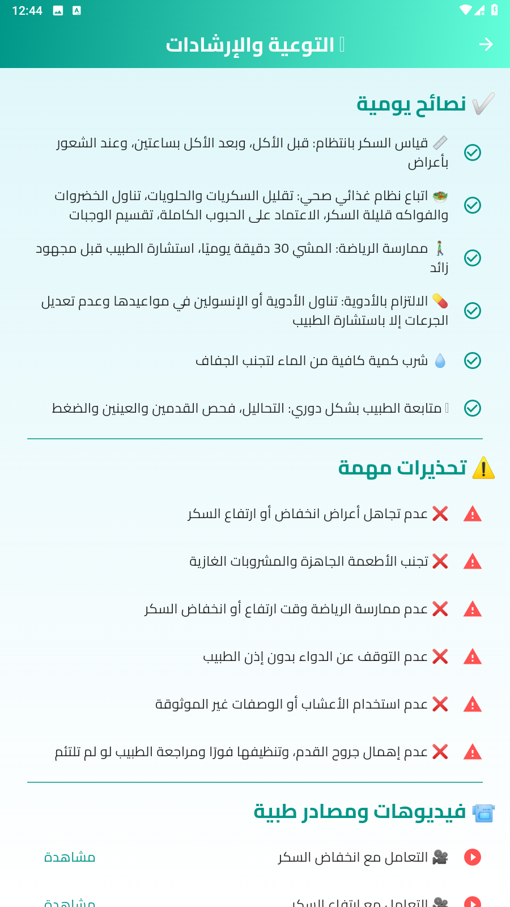

# 🩺 Diabetes Management

A **smart, AI-powered mobile application** designed to help individuals manage diabetes effectively.  
The app provides real-time health tracking, personalized reminders, emergency alerts, and seamless doctor-patient communication — all within one intuitive platform.

---

## 🚀 Features

* **📊 Blood Sugar Monitoring**  
  Log and analyze glucose levels, with the ability to upload lab reports or blood test images.

* **⏰ Personalized Reminders**  
  Custom alerts for medication schedules, insulin doses, and water intake.

* **👨‍⚕️ Doctor-Patient Interaction**  
  A structured follow-up system where doctors can:
  - Monitor their connected patients  
  - View real-time health updates  
  - Send personalized advice or guidance based on the patient's condition

* **🤖 AI-Powered Predictions**
  
  Advanced machine learning models support two key features:
  
  - **Diabetes Risk Prediction**  
    Analyze user health metrics to assess the likelihood of developing diabetes and provide preventive recommendations.

  - **Alternative Medication Suggestions**  
    Offer AI-driven suggestions for alternative medications based on availability, cost, or user-specific conditions — enhancing treatment flexibility.

---

## 🛠️ Tech Stack

* **Frontend:** Flutter  
* **Backend:** Django + Django REST Framework  
* **AI/ML:** Python Machine Learning Models (for risk prediction & drug alternatives)  
* **Database:** PostgreSQL (production) / SQLite (development)  
* **Authentication:** JWT (via dj-rest-auth & django-allauth)

---

## 📸 Project Screenshots

### 🔐 Account & Auth Screens

  
  
  

### 📅 Dashboard Screen

### 📊 Profile & Daily Reminders Screens

  
  

### 🤖 AI Features

  
  

### 🩺 Doctor Features

  
  

### 🧠 Recommendations

  

